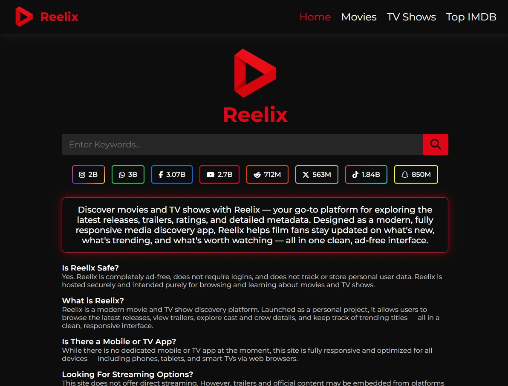

# Reelix

## Project Summary

Reelix is a modern web app for discovering movies and TV shows using live data from the TMDB API. It offers a cinematic, intuitive experience for exploring new releases, top-rated titles, and detailed metadata including trailers, cast, directors, genres, and countries.

Addressing the common issues of cluttered interfaces and limited filtering on other platforms, Reelix provides a clean, responsive UI focused on discoverability and speed. Built with React and Vite, it features modular architecture, optimized API calls, and seamless client-side routing via React Router.

The desktop-first design ensures great presentation on larger screens with full responsiveness for mobile. A dark theme with red highlights delivers a consistent, immersive look. Regional auto-language detection supports Spanish, French, Portuguese, and German, enhancing accessibility. Future plans include user accounts, watchlists, and ratings.

## Table of Contents

- [Usage](#usage)
- [Mock-Up](#mock-up)
- [Instructions](#instructions)
- [Key Features](#key-features)
- [Technology Stack](#technology-stack)

## Usage

To start the application locally or in production:

#### 1. Install dependencies

```bash
npm install
```

#### 2. Run the development server

```bash
npm run dev
```

#### 3. Build for production

```bash
npm run build
```

#### 4. Preview production build

```bash
npm run preview
```

Make sure to create a `.env` file in the root of the project with the following:

- PORT=4173
- VITE_TMDB_API_KEY=your_tmdb_api_key

## Mock-Up

The following image shows the web application's appearance and functionality:




## Instructions

To use this application, follow these simple steps:

### 1. Clone the repository

```bash
git clone https://github.com/yourusername/reelix.git
cd reelix
```

### 2. Create `.env` file

Add your TMDB API key to the .env file as shown above.

### 3. Install and start

```bash
npm install
npm run dev
```

### 4. Deploy

This project can be deployed to platforms like Render:

- Select Web Service

- Use `npm install && npm run build` as the build command

- Use `npm run preview` as the start command

- Set environment variables including your VITE_TMDB_API_KEY and PORT

- Ensure vite.config.js allows the deployment host under preview.allowedHosts

## Key Features

- **Responsive Filters:** Users can filter by genre, year, and country.

- **Vite-Powered Performance:** Fast development server, optimized build, and preview commands.

- **Pagination Support:** Custom-styled pagination allows users to navigate through large result sets.

- **Detailed Media Pages:** Each movie or show has a full page with poster, trailer, cast, crew, genres, and more.

- **Multilingual Auto-Translation:** Supports German, Spanish, Portuguese, and French based on region settings.

- **Dynamic Movie & TV Data:** Fetches and renders media info using the TMDB API, including metadata and trailers.

- **Modular Architecture:** Reusable components like MediaDetail, MediaBanner, and Filter keep the code maintainable.

- **Dark UI with Red Accents:** Consistent, cinematic design styled with CSS Modules and a clean component architecture.

## Technology Stack

- **Node.js + npm:** Dependency and script management.

- **React:** Core library for building the user interface using components.

- **dotenv:** Used to load environment variables like the API key and port.

- **React Router DOM:** Handles dynamic routing for detail pages and filters.

- **CSS Modules:** Provides scoped, maintainable styling for each component.

- **Vite:** Fast bundler and dev server optimized for modern JavaScript projects.

- **TMDB API:** Source for real-time media data including metadata, images, and videos.

- **Render:** Used for deploying the app as a web service with dynamic port configuration.

## Deployed Application

[Reelix](https://reelix.onrender.com)
